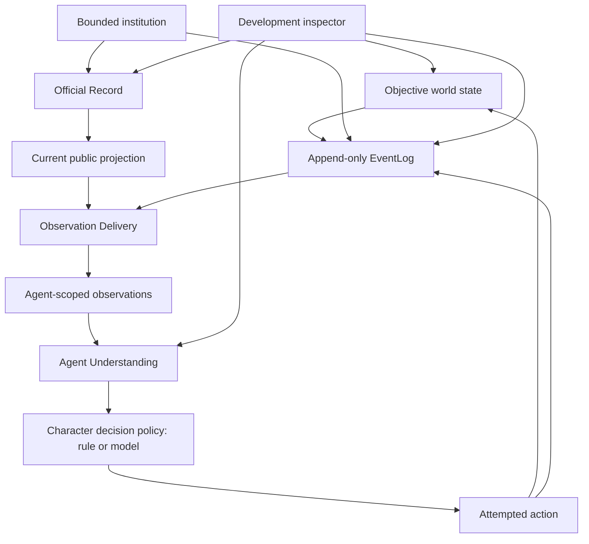
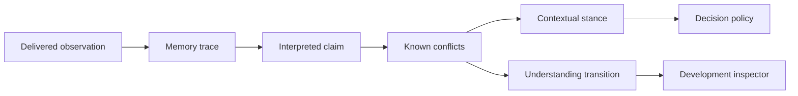

# The Lie and Doublethink: Proposed Architecture

Status: proposal for exploration, not a settled interface or permanent architecture.
The owner-approved direction is to begin model-backed character decisions with
the focal character. It is now bounded by the active
[Model-Backed Focal Character goal](model-backed-focal-character/GOAL.md).

This document describes how a mutable official history and a doublethink-inspired agent model can fit into 2084 without allowing propaganda to overwrite the simulation's actual past.

It builds on the state distinctions already established in [ARCHITECTURE.md](../main/ARCHITECTURE.md), the experiential direction in [CORE_CONSTRUCT.md](../main/CORE_CONSTRUCT.md), and the reference limits in [DESIGN_REFERENCES.md](../main/DESIGN_REFERENCES.md).

## The Question This Architecture Explores

Can 2084 create understandable behavior from a conflict among:

- what objectively happened;
- what the institution currently publishes;
- what a person experienced and remembers;
- what they accept in a particular context;
- and what they publicly say or do?

The architecture is working when an official revision changes the public world, different agents encounter different versions, and one agent responds differently in private and public while the development inspector can still explain the complete causal chain.

It is not enough for a variable to change or for a policy to follow a scripted branch. The observer should be able to see a meaningful consequence of the contradiction.

## Scope

The proposal contains four modules:

1. **Official Record** — the institution's mutable public projection of history.
2. **Agent Understanding** — source-linked memory, belief, contradiction, confidence, contextual acceptance, and suppression.
3. **Claim and Provenance** — shared claim semantics, extracted only after the first two modules create a real seam.
4. **Observation Delivery** — the channels through which events and artifacts become agent-specific observations.

The proposal does not attempt to build a complete propaganda ministry, general human psychology, arbitrary natural-language fact checking, or an omniscient surveillance state.

## Existing Foundation to Preserve

The current implementation already protects several important invariants:

- `WorldState` contains mutable objective conditions.
- `EventLog` contains immutable, append-only objective events and source-linked observations.
- policies receive restricted agent or institution views rather than omniscient state.
- attempted actions are separate from resolved consequences.
- the normal observer is separate from the omniscient development inspector.
- deterministic history data preserves enough evidence to reproduce the current slice.

`EventLog` is already a deep module. It should remain the record of what occurred in the simulation, including institutional acts of revision. The Official Record must sit beside it rather than replace it.

## Overall Fit

The normal causal direction is:

1. Something happens or an institution decides to revise an official artifact.
2. The objective act is appended to `EventLog`.
3. The Official Record changes its current public projection when the act is valid and processed.
4. Observation Delivery determines who encounters the new projection, through which channel, and when.
5. Agent Understanding updates only from observations delivered to that agent.
6. A decision policy chooses an attempted action from the agent's limited current understanding.
7. World rules resolve the attempt and record its consequences.

## Model-Backed Focal Character Boundary

A model-backed focal character is not an AI adviser attached to a separately
scripted actor. When the focal character uses a model-backed decision policy,
the model's validated choices become that character's attempted actions and
expressions.

The persistent character is larger than any one model call. Character identity,
embodied state, delivered observations, source-linked memory, relationships,
aims, plans, and prior outcomes remain explicit simulation state. The model
receives a restricted projection of that state and decides what the character
attempts next.

The model may reason about the current situation, weigh aims and risks, choose
an action, and phrase speech. It may not inspect objective hidden state, another
character's private state, or the development inspector. It may not directly
mutate memory, records, resources, locations, or relationships, and it may not
declare that an attempt succeeded. World rules validate and resolve its choices.

Agent Understanding remains the shared, inspectable cognitive substrate. It
owns facts such as which observations were delivered, where a memory came from,
which structured claims conflict, and which transitions were retained. A model
may use that understanding and may later propose bounded interpretations or
plans, but opaque model conversation history must not become the only canonical
memory of the character.

Begin with the focal character only. Generalize model-backed decisions to
supporting characters only after the focal implementation demonstrates limited
knowledge, persistent identity, inspectable decisions, safe failure handling,
and recorded reproduction without granting the model authority over the world.

## Core Invariants

These invariants apply across all four modules.

### Objective history is never rewritten

An official statement that the weekly ration entitlement was always two packets
does not change the earlier three-packet schedule, the two-packet physical
handover, or the event in which the institution revised the schedule.

### Official does not mean objectively true

The Official Record represents institutional publication. Its authority is social and operational, not metaphysical.

### A changed record does not grant knowledge

Changing the public projection does not instantly update every agent. An agent must encounter a broadcast, document, person, or other channel that exposes the new version.

### Agent understanding does not alter the world

Confidence, suppression, contextual acceptance, or public conformity can change an agent's decisions. They cannot change objective state or declare an action successful.

### Public expression remains an action

What an agent says is not identical to what they remember or privately accept. Speaking remains an attempted action selected under pressure and resolved in the world.

### Institutional power remains bounded

Record revision requires information, authority, processing, time, and an identifiable target. The institution cannot read private memory or edit physical artifacts it cannot access.

### Suppression remains inspectable

A suppressed contradiction may become unavailable to ordinary decision-making in one context. The underlying source and transition remain available to the development inspector and may resurface through a later cue.

## Module 1: Official Record

### Purpose

The Official Record owns the institution's current public projection of selected history. It is the software representation of **the Lie**.

Its job is not to decide objective truth. Its job is to apply valid institutional record operations to structured official artifacts and expose what the public archive currently shows.

### Current architectural friction

The current implementation distributes official-history behavior across:

- `InstitutionState.records`, a generic dictionary;
- `InstitutionPolicy`, which emits a scheduled numeric claim;
- `Simulation._apply_scheduled_institutional_events()`, which records, mutates, links, and broadcasts the claim;
- observation mappings interpreted by beliefs, policies, and observers;
- scenario configuration containing the claim schedule.

The current `institutions.py` module is shallow. Deleting it would mostly relocate its dataclasses while leaving official-record behavior scattered across the repository.

### What the module owns

- the set of official artifacts currently recognized by an institution;
- the current published projection of each artifact;
- structured references among official artifacts, people, institutions, places, and claims;
- record-operation validation within the institution's actual authority;
- revision lineage inside the official archive;
- suppression and replacement rules for public references;
- fabrication of official artifacts attributed to an earlier date;
- deterministic rendering inputs for text or media adapters;
- enough prior official state to explain each accepted operation to the inspector.

### What the module does not own

- objective world history;
- agent memories or beliefs;
- who receives a publication;
- institutional motive or strategy;
- private diaries or inaccessible physical records;
- action resolution outside official-record operations;
- observer presentation.

### Official artifacts

The module should operate on structured artifacts rather than arbitrary string replacement. An official artifact may represent a notice, biography, production report, enemy declaration, rule, roster, or ration schedule.

At minimum, an artifact needs enough structure to retain:

- stable official identity;
- artifact kind;
- attributed date or period;
- structured claims;
- structured references to entities or other artifacts;
- current publication status;
- official revision lineage;
- the institutional operation that produced the current projection.

The attributed date belongs to the official narrative. The objective creation tick remains in `EventLog`. A fabricated biography can claim to have existed for twenty years while the inspector shows that the institution created it at tick 40.

### Record operations

#### Rewrite

A rewrite changes the value or wording represented by an existing official artifact.

Example: a weekly ration schedule initially promises three packets per
household. After only two packets are issued, the schedule is rewritten to say
that the entitlement was two packets from the beginning of the week.

The prior official version stops appearing in the current public projection. It remains present in objective event history and may remain in stale physical copies or agent memories.

#### Suppress references

This is the safe form of the proposed "unperson" behavior.

The operation removes or replaces references to a target within the institution's current public projection. It does not delete:

- the actual agent;
- actions the agent performed;
- prior observations of the agent;
- private records outside institutional control;
- physical evidence that has not been found and altered;
- objective events.

If the institution wants the person physically removed, detained, or killed, that requires separate world actions and consequences. Record suppression alone has no impossible physical authority.

#### Fabricate

A fabrication inserts a new official artifact or claim attributed to an earlier time.

The official archive may present a decorated worker as a long-standing historical figure. The operation does not create an objective person who acted in the past. If the world later contains a living impersonator, forged objects, or coached witnesses, those require separate world events.

#### Restore or replace

A later operation may restore a suppressed reference or replace one fabrication with another. This should be represented as another official operation, not a rollback of objective history.

### Institutional processing

Record operations should pass through the same bounded-institution principles as other consequential actions:

1. an institution receives or creates a reason to revise;
2. an authorized policy attempts a record operation;
3. capacity, access, and target validity are checked;
4. the operation may wait in a queue or fail;
5. a successful operation changes the current official projection;
6. `EventLog` records the attempt, resolution, prior official state, and resulting official state;
7. delivery channels may expose the new projection to agents.

The Official Record should never scan the complete objective history to discover what must be hidden unless an institutional process actually has access to that evidence.

### First bounded experiment

Deepen the existing allocation contradiction before adding people, wars, or arbitrary documents.

For this experiment, one unit is concrete: one sealed one-kilogram
staple-grain ration packet issued for household consumption. The packet and
quantity are provisional worldbuilding, chosen to make the contradiction
physical and understandable rather than to establish a permanent economy.

The experiment should demonstrate:

1. an official weekly ration schedule initially promises three packets per
   household;
2. the focal character encounters that schedule through a valid delivery path
   and therefore expects three packets;
3. the physical allocation handover grants only two packets;
4. a later valid operation rewrites the earlier schedule to say that the
   entitlement was two packets from the beginning of the week;
5. reading the current official schedule returns only the two-packet version;
6. the original three-packet publication, its delivery, the physical handover,
   and the rewrite operation all remain in `EventLog`;
7. a diary entry or stale copy may still preserve the original three-packet
   schedule;
8. an unauthorized or invalid rewrite leaves the public projection unchanged.

This experiment proves the truth/record separation without requiring a general text engine.

### Behavior that would show the module is working

- Two agents can consult the same current archive and receive the revised version.
- An agent with only an earlier observation can retain an older version.
- The inspector can show the objective event, both official versions, and the rewrite operation.
- Removing the Official Record implementation would force revision, suppression, and fabrication rules back into several callers.

### Tests

- rewriting changes the public projection but not objective events;
- revision lineage links the new official version to the prior official version;
- fabrication records its real creation tick and separate attributed date;
- suppressed references disappear only from controlled official artifacts;
- unauthorized operations are rejected without mutation;
- queue or capacity limits delay operations deterministically;
- record rendering is deterministic for the same structured artifact;
- history data remains JSON-compatible and replay-stable.

## Module 2: Agent Understanding

### Purpose

Agent Understanding owns the agent-side processing of delivered evidence. It is the software representation of the limited, doublethink-inspired cognitive mechanism.

It should make contradiction, reinterpretation, compartmentalization, confidence erosion, and suppression behaviorally relevant without claiming to reproduce human consciousness.

### Current architectural friction

The current `beliefs.py` module:

- recognizes two fixed evidence kinds;
- assigns two fixed confidence values;
- labels direct evidence private and official evidence public;
- retains every incompatible integer as an explicit conflict.

The rest of the intended behavior leaks into other modules:

- `Simulation` assigns identifiers, mutates belief lists, and records transitions;
- `FocalPolicy` scans raw observations and beliefs, applies the conformity threshold, selects private and official values, and decides when the diary matters;
- the terminal observer independently infers which beliefs count as private and public.

The module is therefore shallow relative to the cognitive behavior the project wants.

### What the module owns

- memory traces created from delivered observations;
- source-linked interpreted claims;
- confidence and its explicit changes;
- known contradiction relationships;
- retrieval accessibility in the current context;
- context-dependent acceptance or working stance;
- repetition and authority effects when explicitly configured;
- cognitive strain signals where they affect behavior;
- suppression, inhibition, reinterpretation, and resurfacing transitions;
- an inspectable transition history suitable for replay and explanation.

### What the module does not own

- objective truth;
- official-record mutation;
- observation delivery;
- action choice;
- successful action resolution;
- hidden state belonging to another agent;
- arbitrary natural-language interpretation in the first implementation.

### A more useful model than two overwrite buffers

The literal two-buffer rule—perception versus doctrine, followed by overwriting perception—would erase the behavior the simulation needs to explain.

A better initial model keeps several explicit concepts:

#### Memory trace

A source-linked record that the agent encountered something. It may become less accessible or less trusted, but its provenance is retained.

#### Interpreted claim

What the agent took the observation to assert. Multiple claims may conflict.

#### Confidence

How strongly the agent currently relies on a claim. Confidence changes require traceable causes such as repetition, trusted testimony, official pressure, contradictory experience, or diary consultation.

#### Contextual stance

The claim that currently guides reasoning or action in a particular setting. Work, home, a public counter, and a trusted conversation may activate different stances.

#### Retrieval accessibility

Whether a memory trace is readily available in the present context. Inaccessibility is not deletion.

#### Inhibition or suppression

A transition that prevents a contradiction-sensitive line of reasoning from guiding the current decision. This is the initial representation of crimestop-like behavior.

#### Cognitive strain

An optional, bounded signal that a known contradiction is difficult to maintain. It should exist only if it changes a decision, confidence transition, disclosure, mistake, or other observable consequence.

### Processing flow

An update should remain deterministic unless a particular stochastic mechanism has a clear behavioral reason and uses the simulation's seeded generator.

### Doublethink behavior

Doublethink should emerge from explicit transitions rather than a universal overwrite rule.

One possible sequence is:

1. an agent reads an official schedule promising three ration packets;
2. the agent forms a high-confidence claim linked to that observation;
3. the agent physically receives only two packets;
4. the institution rewrites the earlier schedule to say that the entitlement
   was two packets all along;
5. the agent encounters the revised schedule while retaining the earlier
   three-packet claim and recognizes the conflict;
6. public pressure makes the revised claim the active public stance;
7. the earlier claim remains more accessible at home or when reading the diary;
8. a diary entry later resurfaces the earlier memory and increases strain or
   private confidence;
9. a policy chooses speech or action from the stance active in that context.

This sequence supports public conformity, private doubt, sincere contextual acceptance, and later resurfacing without granting the institution direct control of memory.

### Crimestop as a self-protective transition

The initial crimestop-like mechanism should be modest:

- a contradiction becomes active during reasoning;
- current fear, habit, authority, or context crosses an explicit threshold;
- the Agent Understanding module records an inhibition transition;
- the contradiction is removed from the current working stance;
- the decision policy receives the resulting limited stance;
- the underlying trace remains inspectable and may become accessible later.

The system should not use violent internal language as proof of realism. It should show an observable change: abandoning a question, repeating a formula, changing subject, avoiding a person, failing to consult evidence, or choosing a safer action.

### Public and private behavior

The Agent Understanding module may expose different contextual stances, but it should not directly emit public speech.

The decision policy remains responsible for choosing whether to:

- repeat the official version;
- remain silent;
- ask a question;
- consult a diary;
- test a memory against physical evidence;
- confide in another person;
- or act as though a claim is true.

The world then resolves the attempted action. This preserves the separation between internal state, expression, and consequence.

### First bounded experiment

Use the existing allocation contradiction and diary.

Add only enough cognitive state to demonstrate:

1. direct and official claims remain source-linked;
2. a public-counter context activates the official stance under sufficient pressure;
3. the direct claim remains privately accessible;
4. reading the diary changes accessibility or confidence through an explicit transition;
5. the policy behaves differently before and after the diary cue;
6. the inspector explains every transition without exposing it in the normal observer unless deliberately projected.

Do not add general memory decay, emotion, personality, or language inference in the same experiment.

### Behavior that would show the module is working

- The same agent can act from different claims in different contexts without changing objective state.
- A pressure change alters the contextual stance through a recorded transition rather than a scenario-specific policy branch.
- A diary cue can resurface a suppressed trace.
- Supporting agents can use the same cognitive implementation with different configured trust or pressure conditions.
- Removing the module would spread cognitive rules back across Simulation, policies, and observers.

### Tests

- observations create memory traces only for their recipients;
- claims retain source provenance and explicit conflicts;
- context changes the active stance without deleting traces;
- confidence changes cite a cause and prior value;
- insufficient pressure does not trigger inhibition or public stance change;
- inhibition affects the current stance but remains inspectable;
- diary consultation can resurface a permitted earlier trace;
- undelivered official versions never enter the agent's understanding;
- policy selection remains pure for the same restricted understanding;
- deterministic runs produce identical understanding transitions.

## Module 3: Claim and Provenance

### Purpose

Claim and Provenance would eventually provide shared semantics for claims used by official artifacts, observations, agent understanding, diaries, expressions, and presentation.

It should not be extracted first.

### Why extraction should wait

The same concept is currently repeated as mappings and parallel fields:

- `evidence_kind`;
- `proposition`;
- `asserted_value`;
- `revises_event_id`;
- source observation identifiers;
- repeated claim fields in diary entries and observer output.

This repetition creates friction, but one future consumer would make a shared seam hypothetical. The Official Record should first develop a narrow internal claim representation. Agent Understanding should become the second real adapter. Only then is there enough evidence to extract shared semantics.

### What the module would own

- claim identity;
- subject or proposition identity;
- supported value shapes;
- source provenance;
- attributed time versus objective creation time;
- revision lineage;
- comparison of values within a proposition;
- explicit conflict relationships;
- deterministic, audience-appropriate rendering inputs.

### What the module would not own

- whether a claim is objectively true;
- whether an institution should publish it;
- whether an agent believes it;
- who receives it;
- how a policy acts on it;
- how an observer displays a whole scene.

### Claim scope

The current integer-only allocation claim is too narrow for later official-history behavior. Likely future value shapes include:

- quantity: the weekly household ration entitlement was three packets;
- identity: the declared enemy was Eastasia;
- existence: a named worker appears in an official roster;
- relation: a person belonged to an organization;
- event: a production record says an event occurred on a date;
- rule: an action was always prohibited.

The first extracted module should support only claim kinds already used by two real adapters. It should not become a universal ontology.

### Conflict semantics

Not every different value is automatically a contradiction.

The module must eventually distinguish:

- mutually exclusive values for the same subject and period;
- compatible claims at different times;
- revised wording that preserves the same meaning;
- partial or more specific claims;
- unknown or unresolved comparison.

This comparison logic belongs in one place because official revisions, agent contradictions, diary comparisons, and observer explanations all depend on it.

### Behavior that would show the module is working

- Official Record and Agent Understanding use the same claim identity and conflict rules through separate adapters.
- Adding a second supported claim kind does not require coordinated string changes across policies and observers.
- Provenance remains intact as a claim moves from artifact to observation to memory to expression.
- Deleting the module would duplicate real comparison and provenance behavior in at least two modules.

### Tests

- equal claims compare as equivalent;
- incompatible values for the same subject and period conflict;
- values from different periods do not conflict automatically;
- revision lineage is distinct from objective causation;
- attributed time is distinct from creation tick;
- provenance survives adaptation into official and agent-owned forms;
- unsupported claim kinds fail explicitly rather than degrading into untyped mappings.

## Module 4: Observation Delivery

### Purpose

Observation Delivery owns how objective events and official artifacts become observations for particular agents. It protects limited knowledge while allowing the public record to have broad but non-magical reach.

### Current architectural friction

The current `Simulation` implementation owns:

- recipient selection;
- co-location visibility;
- direct perception;
- one-tick delivery delays;
- source labels;
- queued observation dictionaries;
- immediate global official broadcasts;
- mutation of each agent's observation list.

These rules are spread across completion delivery, scheduled institutional events, and queued delivery. Several real delivery adapters already exist: direct action, co-location, broadcast, allocation handover, and diary interaction.

### What the module owns

- delivery channels;
- intended audience and actual recipients;
- reach and access checks;
- delivery delay;
- location or proximity requirements;
- source attribution;
- conversion of an event or accessible artifact into agent-safe observation details;
- missed delivery, stale versions, and repeated exposure;
- deterministic delivery ordering.

### What the module does not own

- objective event creation;
- official artifact mutation;
- agent belief or memory updates;
- institutional strategy;
- policy choice;
- world consequence resolution.

### Delivery channels

Initial channels may include:

#### Direct perception

The actor or a nearby observer encounters a physical event. Location and visibility determine recipients.

#### Broadcast

An official claim reaches agents covered by a configured channel. Coverage may be broad without being universal. Agents may miss it because of place, equipment, timing, or interruption.

#### Public artifact access

An agent reads the current version of an official record they can physically or institutionally access. The observation reflects the version available at read time.

#### Physical copy

A notice, clipping, or diary may retain an earlier version. Changing the central public projection does not automatically alter uncontrolled physical copies.

#### Social testimony

One agent repeats a claim to another. The new observation is sourced to the speaker and may indirectly reference the official source.

Rumor, surveillance reports, and institutional evidence queues can be added later only when they create a needed interaction.

### Stale and conflicting exposure

A mutable official archive and limited delivery naturally create different knowledge states:

- Agent A read the original three-packet schedule.
- Agent B missed it and later reads the revised two-packet schedule.
- Agent C received two packets after previously reading the three-packet
  schedule, then encounters the revised version.
- Agent D sees a stale printed three-packet schedule after the central archive
  changed.

The world still has one objective history. The agents differ because they received different observations.

### First bounded experiment

Replace the current unconditional global official delivery with one explicit broadcast channel and one public-artifact reading path.

The experiment should demonstrate:

1. the Official Record changes immediately after a resolved revision;
2. an agent covered by the broadcast receives the revision;
3. an uncovered agent does not gain it;
4. a later archive read exposes the current version;
5. a stale physical copy can expose the earlier version;
6. all observations retain source and delivery time.

### Behavior that would show the module is working

- Two agents can hold different official versions because of delivery history.
- Changing the record does not mutate existing observations.
- Reading an artifact returns the version actually accessible at that time and place.
- Adding a new channel does not require adding recipient logic to Simulation.
- Removing the module would spread reach, delay, access, and attribution rules back across several event branches.

### Tests

- direct perception requires the configured physical conditions;
- broadcasts reach only covered agents;
- missed broadcasts create no observation;
- delivery delay is deterministic;
- a current archive read returns the current official version;
- a stale physical copy retains its own version;
- repeated exposure creates separate source-linked observations when appropriate;
- delivery never grants private or objective state not present in its input;
- simultaneous deliveries use stable ordering for replay.

## Relationship Among the Four Modules

| Concern | Owning module | Important seam |
| --- | --- | --- |
| What actually happened | `WorldState` and `EventLog` | Never mutable through propaganda |
| What the institution currently publishes | Official Record | Mutable public projection |
| What a claim means and conflicts with | Claim and Provenance | Extract only after two adapters exist |
| Who encountered which version | Observation Delivery | Source, access, reach, and time |
| What an agent remembers or accepts | Agent Understanding | Agent-owned and context-dependent |
| What an agent decides to say or do | Decision policy | Restricted understanding only |
| Whether an action succeeds | World resolution | Objective constraints and consequences |
| What the normal observer sees | Focal projection | No hidden-state leakage |
| What developers can inspect | Development inspector | Explicitly omniscient |

## Recommended Implementation Order

### Phase 0: Preserve the current evidence

Before changing behavior, retain characterization tests for:

- append-only objective history;
- restricted policy views;
- source-linked observations and beliefs;
- public/private expression divergence;
- diary immutability;
- deterministic replay;
- normal-observer privacy.

### Phase 1: Deepen the Official Record

Move the existing allocation publication and revision into a structured current public projection. Keep delivery behavior temporarily equivalent so the architectural change can be evaluated separately from new simulation behavior.

Success is one rewritten allocation artifact whose prior official version and objective events remain inspectable.

### Phase 2: Add one record-manipulation experiment

Choose either one suppressed reference or one fabricated official artifact. Do not implement both simultaneously.

The experiment must create a decision, uncertainty, interaction, or consequence visible through the focal character. If it produces only inspector data, it is not yet earning its complexity.

### Phase 3A: Establish Bounded Agent Understanding

Move confidence, contextual stance, inhibition, and diary-triggered resurfacing out of scenario-specific policy branches and into one agent-owned implementation.

Keep the decision policy responsible for action choice and public expression.

The completed Agent Understanding goal established a bounded foundation:
source-linked memory traces, explicit official-version conflicts, contextual
public and private stances, diary-triggered resurfacing, and stance-sensitive
action choice. Confidence change, general retrieval accessibility, inhibition,
and supporting-agent understanding remain deferred rather than implicitly
complete.

### Phase 3B: Embody the Focal Character With a Model

Replace the focal character's hand-written action selection with one
model-backed decision policy. The model is the focal character's decision and
expression process, not a narrator or suggestion generator whose output is
ignored by a separate scripted actor.

The first bounded implementation should:

- serialize only the focal character's restricted decision view;
- include persistent authored identity, aims, and relevant agent-owned state;
- require one structured attempted action from the existing allowed vocabulary;
- pass every attempt through existing world validation and resolution;
- deliver completed or rejected outcomes back through normal agent-safe state;
- record the model configuration, restricted input, structured response,
  validation result, and accepted attempt for inspection;
- provide a safe timeout, malformed-output, and unavailable-model fallback;
- support tests with a deterministic fake model and reproduction from recorded
  decisions without requiring a live model call.

Success is not merely plausible prose. The same restricted situation must lead
to an inspectable model-selected attempt that can fail normally, affect the
world only through resolution, and be explained from information the focal
character actually possessed.

### Phase 4: Extract Claim and Provenance

Compare the actual claim needs of Official Record and Agent Understanding. Extract only their demonstrated common semantics.

Do not design a general claim language in advance.

### Phase 5: Deepen Observation Delivery

Replace global official delivery and raw queued dictionaries with explicit channels, access, reach, delay, and source attribution.

Do this before expanding record revision to a wider population or more artifact types.

## Expected File Impact

This is a responsibility map, not a proposed concrete interface.

| Current file | Expected architectural change |
| --- | --- |
| `simulation/events.py` | Preserve as append-only objective evidence and delivery provenance. |
| `simulation/institutions.py` | Deepen around official artifacts, public projection, bounded record operations, and institutional state. |
| `policies/institution_policy.py` | Choose attempted institutional operations from restricted institutional knowledge; do not mutate records directly. |
| `simulation/beliefs.py` | Evolve or be replaced by the deeper Agent Understanding implementation. |
| `simulation/agents.py` | Hold agent-owned understanding state and expose a restricted decision view. |
| `simulation/engine.py` | Preserve tick order and coordination while releasing official-record, understanding, and delivery implementation details. |
| `policies/focal_policy.py` | Consume contextual understanding rather than reconstructing cognition from raw mappings. |
| model-policy adapter | Turn a restricted focal view into one structured attempted action; own no world state or consequences. |
| `simulation/world.py` | Continue to own objective physical state, including physical copies and diaries. |
| `observer/terminal.py` | Render only deliberately projected focal understanding and encountered official artifacts. |
| `observer/inspector.py` | Show objective events, official operations and versions, delivery history, and understanding transitions as distinct records. |
| `scenarios/first_day.py` | Configure the small experiment without implementing the general mechanisms. |
| `tests/test_living_simulation.py` | Retain end-to-end behavior while focused module tests carry most new mechanism coverage. |

## Testing Strategy

### Module tests

Each deep module should be testable through its narrow public interface:

- Official Record tests mutate and query a public projection while checking immutable evidence.
- Agent Understanding tests apply delivered observations and inspect transitions and contextual stance.
- Claim and Provenance tests compare structured claims and retain lineage.
- Observation Delivery tests vary channel, access, recipient, and delay.

### Integration tests

Integration tests should focus on the seams:

- accepted official operation produces both a changed projection and an objective event;
- artifact exposure produces an observation without granting hidden state;
- observation produces an agent-owned understanding transition;
- contextual understanding affects an attempted action;
- world resolution produces an inspectable consequence.

### End-to-end behavioral tests

One small scenario should demonstrate the complete loop:

1. the focal character directly encounters a quantity;
2. the institution publishes and later rewrites an incompatible official version;
3. another agent encounters only the revised version;
4. public pressure changes the focal character's contextual stance;
5. the focal character publicly conforms or avoids contradiction;
6. a diary or stale artifact later resurfaces the earlier perspective;
7. subsequent behavior changes in a way the observer can understand;
8. the inspector reconstructs the complete causal chain.

The test should distinguish authored starting conditions from behavior produced by the mechanisms.

## Failure Modes to Avoid

### Rewriting `EventLog`

This destroys replay evidence and makes deception indistinguishable from simulation corruption.

### Treating a record change as a broadcast

The archive may change without every agent learning about it.

### Deleting memories on conflict

This removes provenance, prevents resurfacing, and reduces doublethink to assignment.

### Putting cognition inside each policy

This duplicates psychological rules and makes different agents impossible to compare through one test surface.

A model-backed policy may reason, plan, and phrase behavior, but it must consume
the shared agent-owned evidence and understanding rather than privately
reconstructing canonical memory from an uninspectable prompt history.

### Using AI as a cosmetic narrator

If a model only describes a choice already made by a hand-written policy, it is
not the character's decision process. In the model-backed focal phase, the
model's valid structured choice must become the focal character's attempted
action.

### Giving the model world authority

A fluent model response is not an observation, successful action, or objective
event. Models propose attempts; world rules determine consequences and delivery.

### Giving the institution omniscient targets

The institution must acquire evidence and authority before it can suppress a reference or alter a controlled artifact.

### Global text replacement

Arbitrary string replacement cannot distinguish official artifacts, private objects, namesakes, quotations, or inaccessible copies.

### Premature generalization

A universal document model, claim language, or psychology system would obscure the first behavioral question. Start with one allocation artifact and one consequential contradiction.

### Hardcoding the outcome

The scenario may schedule the initial pressure, but it should not secretly force conformity, discovery, collapse, or institutional victory and then label it emergence.

## Removal Tests

A new mechanism should be removed or simplified when:

- it produces only inspector data and no understandable behavior;
- its interface is nearly as complex as its implementation;
- deleting it would merely move a few lines rather than concentrate complexity;
- it grants an institution or agent information they could not obtain;
- a simpler rule produces the same interaction and consequence;
- it exists mainly to imitate the full world of *Nineteen Eighty-Four*.

## Open Decisions

These choices should remain open until the first Official Record experiment produces evidence:

- Which official artifact anchors the first reusable rewrite?
- Does the first follow-up explore suppression or fabrication?
- What institutional role is authorized to request and approve a rewrite?
- Does record processing consume time or capacity in the first experiment?
- Which agents can access the archive directly?
- Which contextual factors can change an agent's active stance initially?
- What does the normal observer see about suppression or rationalization?
- Which cognitive transition creates a visible change after the diary is read?
- When do two real claim adapters justify extracting Claim and Provenance?

## Recommended First Decision

Begin with the Official Record module and the existing allocation contradiction.

The smallest useful result is not a complete deception system. It is one official artifact whose current public version can be rewritten while:

- objective events remain unchanged;
- prior official publication remains inspectable;
- agents learn only through delivery;
- a private or stale record can preserve an earlier version;
- and the contradiction changes an understandable decision.

That result would establish the foundation for doublethink-inspired behavior without confusing propaganda, memory, and truth.
