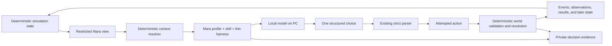

# Mara Model Harness Plan

Status: owner-directed architecture plan for completing the active
Model-Backed Focal Character goal. This document records the decisions made in
the August 22, 2026 harness discussion. It does not authorize work on the
later 24-hour simulation foundation.

## Purpose

Build the smallest model harness that allows a locally hosted model to make
Mara Vale's actual simulation decisions while preserving the simulation's
authority over truth, knowledge, physical possibility, time, and consequence.

The immediate sequence is:

1. Define Mara's stable character profile and first reusable decision skill.
2. Connect those authored inputs and the existing restricted decision envelope
   to one locally hosted model.
3. Return exactly one structured attempted action through the existing
   `ModelFocalPolicy` boundary.
4. Run and inspect an explicitly opted-in live-model smoke test.
5. Document the live entry path and complete MF-10 without weakening MF-1
   through MF-9.

The 24-hour simulation foundation is deliberately deferred until model-backed
Mara can be observed interacting with the current bounded world.

## Architectural Thesis

The harness follows this division:

> Fat deterministic world + fat Mara skills + thin decision harness.

Intelligence and adaptable judgment belong in Mara's authored skills and the
model. Reliable execution belongs in deterministic simulation code. The
harness between them should remain narrow and replaceable.

This is not a plan to create a second simulation inside the model, a general
agent framework, or a model that directly manipulates world state.

## Fundamental Direction of Control

The simulation invokes Mara when she is eligible to decide. Mara does not
invoke or control the simulation directly.



There are two controlled contacts with the simulation:

1. Before inference, deterministic code projects an agent-safe view of Mara's
   present circumstances and affordances.
2. After inference, deterministic code validates and resolves the proposed
   action against authoritative world state.

The model has no other path into the simulation.

## The Three Mara Inputs

The model context must keep three categories conceptually distinct.

### 1. Character profile: who Mara is

The profile is stable authored material. It may describe:

- identity and social role;
- temperament and habitual perspective;
- enduring values and tensions;
- responsibilities and broad priorities;
- conversational voice and expressive tendencies;
- how uncertainty, risk, obligation, and social pressure generally feel to
  her.

The profile must not contain hidden world facts, inspector knowledge, future
events, or a prescribed scenario route.

Stable profile material should be short enough to remain present at every Mara
decision. It is not a substitute for mutable simulation state.

### 2. Skills: how Mara approaches recurring decisions

A skill is a reusable authored procedure for judgment. It teaches Mara how to
approach a class of decisions without deciding the outcome in advance.

The first model-backed version should begin with one primary skill, tentatively
called `choose-next-action`. It should teach Mara to:

- reason only from the supplied character-safe context;
- consider current aims, obligations, location, access, and holdings;
- take completed and rejected prior outcomes seriously;
- distinguish delivered evidence from suspicion or unsupported invention;
- notice relevant conflicts in her source-linked understanding;
- weigh available actions without assuming any will succeed;
- choose exactly one attempted action;
- provide a concise in-character explanation and decision reason;
- stop after producing the required structured choice.

Further skills should be introduced only after repeated observed behavior
shows that one reusable procedure is missing. Possible later candidates include
public expression or diary use, but they are not required for the initial live
integration.

A skill must not encode the first-day plot. Instructions such as "after the
ration discrepancy, go home and write in the diary" would merely recreate the
scripted focal policy in prose and are prohibited.

### 3. Decision envelope: what is true for Mara now

The decision envelope is produced fresh from the existing restricted
`AgentView`. It supplies current, agent-owned material such as:

- current simulation tick;
- location, aims, obligations, holdings, and unmet need;
- completed and rejected action results available to Mara;
- delivered observations and their source links;
- beliefs, memory traces, interpreted claims, and current contextual stance;
- accessible diary state and consultable artifacts;
- reachable destinations and other current affordances;
- supported action kinds and exact parameter contracts.

The envelope is mutable simulation data, not authored character lore. It must
remain detached, inspectable, and reproducible.

Opaque provider conversation history must not become a fourth category. Each
decision should be reconstructible from the supplied profile, selected skill,
fresh restricted envelope, configuration identity, and recorded response.

## Fat Determinism

"Fat determinism" is the dependable substrate around Mara's uncertain model
judgment. It is primarily the simulation, not code hidden inside the harness.

The deterministic layer owns:

- objective world truth;
- simulation time and action duration;
- physical location, access, possession, and resource state;
- observation eligibility, delivery, and provenance;
- canonical agent understanding and source-linked memory;
- the list and shape of supported actions;
- current action affordances exposed to Mara;
- schema validation and world-semantic validation;
- action scheduling, success, rejection, and consequence;
- seeded randomness where it is eventually used;
- append-only objective events;
- actor-safe action results;
- private decision evidence and recorded-decision reproduction.

Deterministic helpers may participate in harness preparation, but only in
read-only ways. They may:

- select an applicable skill from the restricted view;
- assemble and serialize context;
- impose explicit context budgets;
- render an action schema;
- parse and validate the returned object;
- sanitize and record failures.

They may not:

- choose a different action after receiving a valid model choice;
- silently fall back to the scripted Mara policy;
- infer or load hidden world information for the model;
- mutate the world during prompt assembly;
- convert model prose into an objective fact or observation;
- declare that an attempted action succeeded.

### Example

If Mara is at home, the deterministic simulation may expose that the workplace
is reachable and the diary is accessible. Her decision skill helps the model
weigh those possibilities. If the model selects travel to the workplace, the
harness returns that structured attempt. The simulation then independently
checks the route, schedules the correct duration, completes or rejects the
travel, and later delivers an actor-safe result.

The model never calls `move_mara`, edits her location, or decides that she has
arrived.

## Thin Harness Responsibilities

The harness should perform only the following orchestration:

1. Accept one detached restricted decision envelope.
2. Load Mara's stable profile.
3. Deterministically select the minimum applicable skill material.
4. Compose a versioned model request.
5. Call the configured local model with an explicit timeout.
6. Extract one candidate structured choice from the provider response.
7. Hand the candidate to the existing strict parser.
8. Record sanitized decision evidence or an explicit safe failure.
9. Return one attempted action to the existing simulation boundary.

The harness does not own:

- world or agent persistence;
- simulation scheduling;
- normal observer presentation;
- a general tool-calling loop;
- unrestricted file, shell, network, or database tools for Mara;
- model-created canonical memory;
- direct action execution;
- provider-managed conversation state;
- the future always-running simulation process;
- a general multi-provider plugin system.

For the first live integration, one inference call should produce one attempted
action. Mara should not enter an open-ended internal tool loop.

## Deterministic Context Resolver

The resolver answers only: which authored material is needed for this decision?

It may consider agent-safe facts already present in `AgentView`, such as:

- current applicable action kinds;
- whether a diary or official record is accessible;
- the presence of delivered conflicting claims;
- whether recent actor-safe results require a response.

It must not consult objective events, another agent's private state,
institutional secrets, the inspector, or future scenario schedules.

Initially, the safest resolver is intentionally boring:

- always include the stable Mara profile;
- always include the single `choose-next-action` skill;
- include no optional specialized skill until a second real skill exists.

This preserves a clean future seam without building speculative routing logic.

## Model-Neutral Decision Contract

The stable semantic contract should remain provider-neutral even though the
first transport is singular.

Conceptually, a request contains:

```text
DecisionRequest
  contract_version
  decision_id
  configuration_id
  character_profile
  selected_skills
  restricted_state
  action_contract
```

The model returns exactly:

```text
DecisionResponse
  kind
  parameters
  explanation
  decision_reason
```

The existing response field set and action parameter contracts remain
authoritative. The live adapter must adapt the provider to this contract rather
than changing the world contract to match a provider.

"Works with any model" means that any model capable of meeting the minimum
context, instruction-following, latency, and structured-response requirements
can be evaluated without changing the simulation. It does not mean every model
will produce equally coherent Mara behavior.

Weak schema adherence, shallow reasoning, excessive latency, or insufficient
context are model capabilities to measure and expose. They should not cause the
harness to accumulate hidden scripted corrections.

## Prompt Composition

The initial prompt should have four visible layers:

1. **Stable boundary instructions** — one action, restricted evidence only,
   attempted action rather than declared outcome, exact response shape.
2. **Mara profile** — stable identity, perspective, values, tensions, and voice.
3. **Selected decision skill** — the reusable judgment procedure.
4. **Fresh decision envelope** — the current restricted state and action
   contract.

Stable content should precede dynamic content. The envelope should be clearly
delimited as data so that text appearing inside an observation cannot silently
become a new instruction.

The prompt should not include:

- raw objective event history;
- undelivered official versions;
- supporting-agent private aims or state;
- scenario completion conditions;
- credentials or authorization headers;
- inspector-only decision evidence;
- a hidden desired action;
- a full provider chat transcript.

## Local Model Connection

Development remains on the Mac with the 2084 repository. Model inference runs
on the PC.

The intended process boundary is:

```text
2084 on Mac --local network HTTP--> model server on PC
```

The first live adapter should target one stable HTTP API, preferably an
OpenAI-compatible local endpoint. The exact serving software and model remain
owner choices.

The runtime configuration should provide, without committed secrets:

- model server base URL;
- model identifier;
- request timeout;
- generation settings that materially identify the run;
- optional local-server authentication supplied externally;
- a non-secret configuration identity recorded with decisions.

Changing a model should normally require changing configuration, not simulation
or skill code. Provider-specific request fields and response wrappers belong in
the live adapter only.

Do not build a general multi-provider framework before a second real transport
requires a different interface.

## Structured Output Strategy

The harness should request the strongest structured-output mechanism reliably
supported by the selected local server and model. Regardless of provider
support, the existing strict parser remains the final authority.

The boundary must distinguish:

- provider response transport errors;
- timeouts;
- unavailable models;
- responses that contain no candidate decision object;
- malformed response objects;
- structurally invalid attempted actions;
- schema-valid actions later rejected by world semantics.

Provider-native JSON schema support can reduce malformed output, but it must
not replace local validation. A syntactically valid response can still name an
unsupported action or propose parameters that the world rejects.

## Failure Behavior

The existing explicit safe-failure behavior remains correct:

- timeout, unavailable-model, malformed-response, and structurally invalid
  attempts become sanitized private failure records;
- no failure invokes the scripted focal policy;
- a safe `wait` attempt may preserve simulation progress;
- schema-valid but world-invalid choices reach the ordinary world resolver and
  receive an actor-safe rejection;
- raw exceptions, server responses containing secrets, and authorization data
  do not enter normal history or observer output.

Retries should not be added automatically at first. Multiple generations for
one decision create ambiguity about which response represents Mara's choice.
If a bounded retry is later justified, it must be explicit in decision evidence
and must never apply two choices.

## Decision Evidence and Reproduction

Live sampling is not deterministic. Reproduction comes from recording the
decision boundary, not from pretending that a second model call will return the
same choice.

For each live decision, inspector-only evidence should retain:

- decision ID and simulation tick;
- restricted input;
- profile version;
- skill version or content identity;
- non-secret model configuration identity;
- sanitized structured response;
- parsed attempted action;
- validation status;
- linked attempt and action identifiers;
- eventual resolution and outcome identifier;
- explicit failure classification when applicable.

The existing recorded-decision client should remain able to reuse the exact
structured choice against an equal restricted input without a live call.

Skill and profile identity must be recorded because changing either can change
Mara's decision even when world state and model configuration are unchanged.

## Character Continuity

Mara is the persistent simulation character, not the current model session.

Canonical continuity comes from:

- stable authored profile;
- explicit agent and world state;
- delivered observations;
- source-linked understanding;
- accessible physical records;
- prior attempted actions;
- completed and rejected actor-safe results;
- explicitly recorded decision evidence.

The provider may perform transient reasoning during a call, but that reasoning
does not become memory, truth, belief, or world state merely because it was
generated.

If Mara later forms a durable plan, interpretation, preference change, or other
persistent internal state through a model, that requires its own explicit,
inspectable simulation mechanism. It is not part of this harness plan.

## Relationship to Existing Code

The current implementation already provides most of the lower boundary:

- `simulation/agents.py` defines `AgentView`, `DecisionPolicy`, and private
  `PolicyDecisionRecord` evidence.
- `policies/model_focal_policy.py` serializes the restricted model input,
  exposes current affordances, defines the narrow `ModelDecisionClient` seam,
  calls a client, strictly parses the response, records success or safe
  failure, and supports recorded decisions.
- `simulation/actions.py` defines the supported action vocabulary and parameter
  shapes.
- `simulation/engine.py` supplies restricted views and remains authoritative
  over validation, scheduling, resolution, delivery, and consequence.
- `scenarios/first_day.py` is the composition boundary where an explicitly
  configured model-backed focal policy can be injected.
- `tests/test_model_focal_policy.py` provides the current offline proof for
  restricted input, action parsing, failure, privacy, causality, and recorded
  reproduction.

The harness should extend these seams rather than replace them.

The likely missing implementation pieces are:

- authored Mara profile material;
- the first reusable Mara decision skill;
- deterministic prompt composition;
- one live local-model adapter;
- response extraction into the existing structured choice;
- an explicitly opt-in model-backed entry path;
- documentation and one inspected live smoke run.

Exact file placement and names remain implementation decisions to be selected
from fresh repository evidence when work begins.

## Evaluation Strategy

Repository validation must remain offline. Live evaluation is additional,
explicitly opted-in evidence.

### Offline checks

Offline tests should continue to verify:

- exact restricted input and absence of hidden state;
- deterministic skill selection;
- detached prompt/request construction;
- exact response extraction and strict parsing;
- timeout and unavailable-model handling;
- malformed and invalid response handling;
- no fallback to the scripted focal policy;
- decision evidence privacy;
- equal recorded-decision reproduction;
- unchanged scripted first-day regression behavior.

A fake transport should test live-adapter request construction and provider
response normalization without network access.

### Live smoke

The opt-in live smoke should demonstrate at least one real decision boundary:

1. Start the configured local server on the PC.
2. Confirm the selected model is available without exposing credentials.
3. Run the documented model-backed first-day entry path.
4. Verify that the model receives only the restricted decision request.
5. Verify that one schema-valid model response becomes Mara's attempted action.
6. Verify that the unchanged world resolver accepts, schedules, completes, or
   rejects it.
7. Inspect the linked private decision record and objective consequence.
8. Confirm normal observer output does not reveal private prompt or model
   configuration details.
9. Record honest evidence, including variability and any model limitation.

The smoke test proves that the live boundary works. It does not prove that the
model is deterministic or that Mara is fully believable.

## MF-10 Completion Boundary

The harness work completes the active Model-Backed Focal Character goal only
when all of the following are true:

- the default deterministic first-day mode remains available;
- an explicitly selected model-backed entry path is documented and usable;
- no OpenAI API credential is required when using the configured local server,
  except any optional authentication chosen for that local server;
- credentials and authorization data remain external and unrecorded;
- the full repository check passes offline;
- one owner-authorized live-model smoke test succeeds;
- the inspector preserves the distinction among model input, response,
  attempted action, validation, and consequence;
- normal presentation preserves the focal privacy boundary;
- recorded-decision reproduction remains available;
- independent review confirms MF-1 through MF-10 without broadening the goal.

If the live server or selected model is unavailable, MF-10 remains open. The
goal must not be weakened or marked complete based only on fake-client evidence.

## Explicit Non-Goals

This plan does not include:

- the 24-hour simulation foundation;
- an always-running daemon or durable simulation scheduler;
- graphical UI work;
- model-backed supporting characters;
- a multi-agent conversation framework;
- a general provider marketplace or router;
- direct model tools for world mutation;
- arbitrary model-created memories or claims;
- heavy doublethink mechanisms;
- emotion simulation, memory decay, theory of mind, or consciousness claims;
- new action kinds added only to produce a more dramatic demonstration;
- training, fine-tuning, or automatic skill rewriting;
- claiming that any model can portray Mara equally well.

## Deferred Architecture

A later 24-hour foundation will require its own owner-approved goal and may add
durable checkpoints, pacing, discrete-event scheduling, and crash recovery.
Those concerns must remain outside the Mara decision harness so they do not
turn it into a general runtime.

No choices about that later foundation are required to finish model-backed
Mara.

## Decisions Already Made

- GPT-5.6 Sol runs the autonomous implementation loop; it is not Mara.
- Mara is backed by a locally hosted model running on the PC.
- The 2084 repository, simulation, and harness are developed on the Mac.
- Mac and PC communicate over a private local-network model API.
- The harness must permit model replacement through a stable contract and
  configuration, without making frequent routing a central feature.
- The design follows thin harness, fat skills, and fat determinism.
- Mara's model chooses actual attempted actions rather than commenting on a
  scripted choice.
- The simulation invokes Mara at a decision point.
- The model returns one attempted action and never directly changes the world.
- Persistent Mara continuity remains explicit simulation state, not provider
  chat history.
- The current active goal stops at MF-10; work on the 24-hour foundation waits.

## Open Decisions for the Mara Skills Discussion

The following choices have intentionally not been made yet:

- the exact content and length of Mara's stable profile;
- which values or tensions define her without prescribing her story;
- the wording and structure of the first `choose-next-action` skill;
- how much expressive voice belongs in the profile versus the skill;
- whether profile and skill artifacts are Markdown, structured data plus
  Markdown, or another simple authored format;
- the exact prompt layout and contract versioning mechanism;
- the local serving software and initial model;
- which structured-output feature the selected server reliably supports;
- the exact opt-in command-line interface for model-backed first-day runs;
- what observed behavior will count as a promising first portrayal of Mara
  beyond merely satisfying the schema.

These questions are the next discussion scope. They should be answered before
implementation adds provider or prompt machinery that silently decides them.

## Definition of Done for This Plan

This plan is satisfied when model-backed Mara can make a real, inspectable
decision through the local model boundary, the deterministic simulation remains
the sole authority over state and consequences, the offline regression suite
remains independent of the model server, and the evidence required by MF-10 is
complete.
